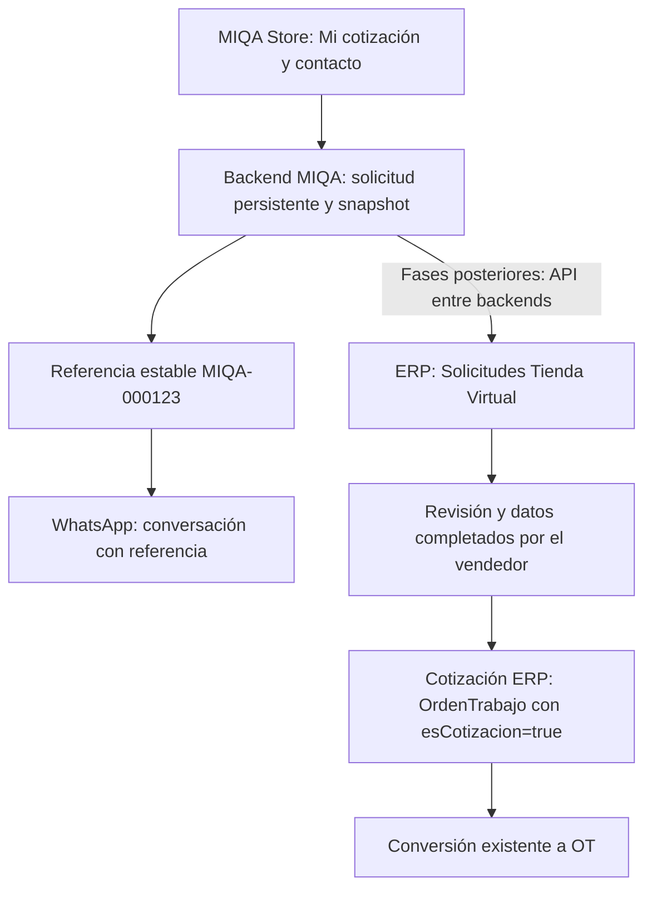

# Proyecto MIQA Store → WhatsApp → ERP

Inicio formal: **2026-09-28**. Fase activa: **Fase 1 — Solicitud Web persistente en MIQA**.

Este conjunto de documentos registra el flujo funcional y las decisiones acordadas para integrar las solicitudes de la tienda con la atención comercial y el ERP. La Solicitud Web persistente está implementada y su integración local real fue validada el **2026-09-28**, según confirmación del propietario. Angular y WhatsApp posterior a persistencia están implementados localmente, sin commit del frontend ni despliegue.

Flujo validado: Angular `localhost:4200` → backend TEST `localhost:8081` → PostgreSQL TEST `127.0.0.1:55432/miqa_store_test_db` → solicitud persistida → referencia devuelta al frontend → WhatsApp preparado después de persistir. La prueba generó `MIQA-000017` únicamente en TEST; se comprobaron `RECIBIDA` / `TIENDA_VIRTUAL`, Roll Up, `QUANTITY`, cantidad **5** y snapshot histórico JSONB persistido. No se documentan datos personales de la prueba.

## Objetivo

Conservar en MIQA lo que el cliente solicita antes de abrir WhatsApp, asignarle una referencia estable y permitir que posteriormente un vendedor lo revise en el ERP y cree una cotización válida. La solicitud web puede estar completa para MIQA y, aun así, necesitar datos adicionales para el ERP.

## Flujo acordado

1. El cliente entra a MIQA Store, selecciona uno o varios productos y configura cantidades, materiales, medidas, extras y observaciones según corresponda. El soporte futuro de precios permitirá mostrar un precio disponible o «Precio por cotizar».
2. Reúne los productos en «Mi cotización», pulsa «Solicitar cotización» e ingresa sus datos básicos de contacto.
3. MIQA guarda la solicitud y su snapshot histórico. Solo después de confirmar la persistencia devuelve una referencia estable, por ejemplo `MIQA-000123`, y permite abrir WhatsApp.
4. WhatsApp abre con un mensaje que incluye la referencia. Sigue siendo el canal de conversación; cerrar la aplicación o no enviar el mensaje no elimina la solicitud.
5. En una fase posterior, la integración por API entre backends permite que la solicitud aparezca en «Solicitudes Tienda Virtual» del ERP.
6. El vendedor consulta referencia, contacto, productos, cantidades, medidas, materiales, extras, observaciones e información de precio disponible. Completa los datos faltantes y revisa las reglas del ERP.
7. Cuando la información es válida, crea una cotización ERP mediante el mecanismo existente de `OrdenTrabajo` con `esCotizacion=true`. Después puede convertirla en OT mediante el flujo existente del ERP.

La llegada al ERP no depende de extraer el mensaje de WhatsApp ni de que el cliente lo envíe. No se crea directamente una OT desde MIQA.

## Roadmap

| Fase | Alcance | Estado actual |
| --- | --- | --- |
| 1 | Solicitud persistente en MIQA: modelo, referencia, estados, contacto, ítems, cantidades, configuraciones, snapshot, endpoint backend, envío frontend y WhatsApp después de persistir. Sin tocar ERP. | Implementada e integración local real validada el 2026-09-28 exclusivamente en TEST. Revisión de código sin defectos bloqueantes; sin despliegue. |
| 2 | Precios públicos selectivos: conocido/fijo, «Desde» y «Precio por cotizar». | PENDIENTE DE DISEÑO. |
| 3 | Mapeo explícito MIQA → ERP hacia Servicio, Material, Modelo, Variante o Extra. | PENDIENTE DE AUDITORÍA y PENDIENTE DE DISEÑO. |
| 4 | Bandeja ERP «Solicitudes Tienda Virtual». | PENDIENTE DE DISEÑO. |
| 5 | Conversión controlada: Solicitud Web → Cotización ERP → OT. | PENDIENTE DE AUDITORÍA y PENDIENTE DE DISEÑO. |
| 6 | Automatización futura de productos completamente mapeados. | PENDIENTE DE DISEÑO; no habilitada por esta documentación. |

## Estado actual y alcance

Las cantidades editables del catálogo quedaron previamente desplegadas y validadas, según lo comunicado por el propietario. El antecedente en `WORKFLOW.md` es 117 pruebas en 27 archivos. La integración Angular actual pasa **132 tests en 28 archivos**; build correcto con fixtures locales, 13 URLs de sitemap y 14 rutas prerenderizadas. No se verificó producción.

El frontend conserva la cotización local y solicita contacto antes del POST. Reintentos mantienen UUID y payload por pestaña; WhatsApp solo se abre tras recibir referencia, con enlace de respaldo. El backend persistente está validado exclusivamente en TEST: V1–V7 desde esquema vacío y 123 tests, 0 failures, 0 errors, 2 skipped, BUILD SUCCESS. DEV/PROD/ERP no fueron tocados; no hay despliegue ni integración automática con ERP.

Se preservan cantidades editables, SEO moderno, categorías dinámicas, sitemap, prerender y BreadcrumbList. El formulario se integra en panel/drawer sin precios ni nuevos selectores de extras. La idempotencia está cubierta por tests, tanto replay sin duplicados como conflicto 409 sin modificar la solicitud original ni crear otra. La recuperación de intentos pendientes usa `sessionStorage` y está limitada a la sesión/pestaña correspondiente. Pendientes: precios, mapeo ERP, bandeja ERP, conversión a cotización/OT, protección por cliente/proxy y política de acceso/retención. Ver detalles en [Solicitud Web](02-solicitud-web.md).

## Documentos

- [Arquitectura, responsabilidades y límites](01-arquitectura.md).
- [Fase 1: Solicitud Web persistente](02-solicitud-web.md).
- [Precios públicos selectivos](03-precios.md).
- [Mapeo explícito con ERP](04-mapeo-erp.md).
- [Bitácora del proyecto](05-historial.md).
- Contexto general: [PROJECT_CONTEXT.md](../../PROJECT_CONTEXT.md).
- Operación del proyecto: [WORKFLOW.md](../../WORKFLOW.md).

**PENDIENTE DE AUDITORÍA** identifica hechos técnicos que deben comprobarse en los sistemas existentes. **PENDIENTE DE DISEÑO** identifica decisiones todavía no adoptadas. Las descripciones conceptuales no son contratos de API ni esquemas de base de datos definitivos.
